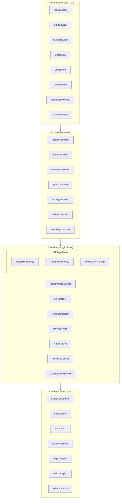

# Li'nage Codebase Analysis

## Executive Summary

**Li'nage** is an advanced, line-level version control system (VCS) and IDE built with C# and .NET 8.0. Unlike traditional VCS like Git that track files as atomic units, Li'nage tracks the history of **individual lines**, enabling unprecedented granularity in code evolution tracking, blame capabilities, and AI-assisted development transparency.

## Project Overview

### Core Concept
Li'nage revolutionizes version control by:
- **Line-Level Tracking**: Maintains complete history of individual line modifications across all commits
- **AI Transparency**: Detects and tracks code contributions generated by AI tools
- **Pluggable Diff Algorithms**: Myers, Patient, and Minimal strategies for different use cases
- **Visual Commit Graph**: Interactive DAG visualization of commit history
- **Multi-Protocol Authentication**: HTTP/HTTPS, SSH, and OAuth support.

### Technology Stack
- **Language**: C# 11.0+
- **Framework**: .NET 8.0 (Windows target)
- **UI**: Windows Forms
- **Database**: SQLite (current), SQL Server (planned migration)
- **Security**: AES-256 encryption, SHA-256 hashing
- **Dependencies**: EntityFramework Core, LibGit2Sharp

---

## Architecture

Li'nage follows a **Four-Layer Clean Architecture**:



---

## Core Components

### 1. Presentation Layer (`GUI/`)

#### MainWindow.cs
The primary application window with a modern 3-pane layout:
- **Left Panel**: Staging view for file selection and commit messages
- **Center Panel**: Tabbed interface for Graph, Editor, and Debug views
- **Bottom Panel**: Terminal view for command execution
- **Menu & Toolbar**: File operations, view controls, remote management, branch selector

#### Key Views
- **StagingView**: File staging area with commit message input
- **GitGraphView**: Custom GDI+ rendering of commit DAG with nodes and edges
- **EditorView**: Split view showing code editor + line-level history side-by-side
- **DebugView**: Real-time log console with timestamps
- **MergeConflictView**: UI for resolving merge conflicts
- **AIHistoryView**: Displays AI-assisted code contributions

### 2. Controller Layer (`Controllers/`)

#### VersionController.cs
Orchestrates version control operations:
- **LoadProject**: Initializes project and starts file monitoring
- **CreateCommit**: Processes staged files, creates snapshots, links to parent commits
- **Database Integration**: Ensures DB creation and manages metadata store
- **Change Detection**: Integrates with `ChangeDetector` for real-time file monitoring

#### AuthController.cs
Manages authentication workflows for remote repositories.

#### RemoteController.cs
Handles remote repository configuration and operations.

#### SyncController.cs
Coordinates push/pull operations with remote servers.

### 3. Business Logic Layer (`Core/`)

#### VersionGraphService.cs
Core version management maintaining the commit DAG:
- **AddCommit**: Adds new commits to the graph
- **CreateBranch**: Creates new branches from commits
- **SwitchBranch**: Switches working directory to different branches
- **GetCommitHistory**: Retrieves commit ancestry
- **FindCommonAncestor**: Locates merge base for branch operations
- **Merge**: Combines divergent branches (requires diff/patch logic)
- **Rebase**: Reapplies commits on top of another base

#### LineTracker.cs
Generates and tracks line-level changes:
- **GenerateLineChanges**: Compares file versions and produces line-by-line deltas
- **Pluggable Diff Strategy**: Uses `IDiffStrategy` interface for algorithm selection
- **Hash Service Integration**: Computes content hashes for line integrity
- **Change Types**: Tracks ADDED, DELETED, and MODIFIED lines with timestamps

#### Diff Algorithms (`Core/Diff/`)

##### MyersDiffStrategy.cs
- **Algorithm**: Eugene Myers' O(ND) diff algorithm
- **Use Case**: General-purpose, balanced performance
- **Output**: Insert, Delete, Equal operations

##### PatientDiffStrategy.cs
- **Algorithm**: Optimized for files with unique lines
- **Use Case**: Long files with distinct content
- **Performance**: Better for large files with low repetition

##### MinimalDiffStrategy.cs
- **Algorithm**: Fast approximation O(N log N)
- **Use Case**: Quick diffs where exact minimal edit distance isn't critical

#### AIActivityService.cs
Tracks AI-assisted code contributions:
- **LogActivity**: Records AI tool usage with confidence levels
- **AssistanceLevel**: Categorizes AI involvement (suggestion, completion, generation)
- **Commit Association**: Links AI activities to specific commits
- **Transparency**: Provides audit trail for AI-generated code

#### ChangeDetector.cs
Real-time file system monitoring for detecting uncommitted changes.

#### MergeService.cs
Handles branch merging and conflict detection.

#### HashService.cs
Cryptographic hashing for content integrity (SHA-256).

### 4. Infrastructure Layer (`Infrastructure/`)

#### LiNageDbContext.cs
Entity Framework Core database context:
- **Current**: SQLite (local storage)
- **Planned**: SQL Server support (configurable via `UseSqlServer` flag)
- **Entities**: Projects, Commits, Snapshots, FileMetadata, LineChanges, Branches, Remotes, AIActivities, Credentials
- **TPH Pattern**: Table-Per-Hierarchy for credential polymorphism

#### CredentialStore.cs
Secure credential management:
- **Storage**: Encrypted JSON file in LocalApplicationData
- **Encryption**: AES-256 via `EncryptionHelper`
- **Credential Types**: HTTP (tokens), SSH (keys), OAuth (tokens with refresh)
- **Operations**: Save, Get, Remove, List, ClearExpired

#### FileWatcher.cs
File system monitoring using `FileSystemWatcher` for real-time change detection.

#### FileService.cs
File I/O operations and metadata extraction.

#### HttpTransport.cs & SshTransport.cs
Network transport implementations for remote repository synchronization.

#### MetadataStore.cs
Abstraction layer for database operations on commits, branches, and snapshots.

---

## Data Models

### Core Entities

#### Commit
```csharp
- CommitId: Guid
- AuthorName: string
- AuthorEmail: string
- Message: string
- Timestamp: DateTime
- Parents: List<Commit>
- Snapshot: Snapshot
- CommitHash: string (SHA-256)
- AiAssisted: bool
```

#### Snapshot
```csharp
- SnapshotId: Guid
- Timestamp: DateTime
- Files: List<FileMetadata>
- Hash: string
```

#### LineChange
```csharp
- ChangeId: Guid
- ChangeType: enum (ADDED, DELETED, MODIFIED)
- LineNumber: int
- OldHash: string
- NewHash: string
- Timestamp: DateTime
```

#### Branch
```csharp
- BranchId: Guid
- Name: string
- HeadCommit: Commit
- IsActive: bool
```

#### AIActivity
```csharp
- ActivityId: Guid
- AITool: string
- AssistanceLevel: enum
- Description: string
- LinesAffected: int
- Confidence: float
- CommitId: Guid
- Timestamp: DateTime
```

### Authentication Models

#### Credential (Abstract Base)
```csharp
- RemoteUrl: string
- CreatedAt: DateTime
- ExpiresAt: DateTime?
```

#### HttpCredential : Credential
```csharp
- Username: string
- PersonalAccessToken: string
```

#### SshCredential : Credential
```csharp
- Username: string
- PrivateKeyPath: string
- Passphrase: string
```

#### OAuthCredential : Credential
```csharp
- AccessToken: string
- RefreshToken: string
- TokenType: string
- Scope: string
```

---

## Development Status

### Phase 1: Foundation ✅ COMPLETED
- Data models (Commit, Snapshot, FileMetadata, LineChange, Branch)
- Database context with Entity Framework Core
- Basic project structure

### Phase 2: Core Features ✅ COMPLETED
- Diff algorithms (Myers, Patient, Minimal)
- LineTracker implementation
- ChangeDetector for file monitoring
- VersionGraphService for commit DAG management

### Phase 3: Authentication & Remote 🔄 IN PROGRESS
- Credential models defined
- CredentialStore with encryption implemented
- Transport interfaces created (HttpTransport, SshTransport)
- **Status**: Skeleton classes exist but contain stub logic

### Phase 4: GUI ✅ COMPLETED (Code Written)
- MainWindow with 3-pane layout
- StagingView for commits
- GitGraphView for visualization
- EditorView with line history
- DebugView for logging
- **Note**: Not compiled/executed due to missing .NET runtime in development environment

### Phase 5: Advanced Features 📋 PLANNED
- AI activity tracking refinement
- Advanced diff strategies
- Conflict resolution UI
- Performance optimizations

---

## Key Features & Innovations

### 1. Line-Level Granularity
Traditional VCS tracks files; Li'nage tracks **individual lines**:
- Complete line history across all commits
- Precise authorship attribution
- Intra-line change detection (via MODIFIED type)

### 2. AI Transparency
Unique feature for modern development:
- Logs AI tool usage (GitHub Copilot, ChatGPT, etc.)
- Tracks confidence levels and assistance types
- Associates AI contributions with specific commits
- Provides audit trail for code provenance

### 3. Pluggable Diff Algorithms
Choose the right tool for the job:
- **Myers**: Balanced, general-purpose
- **Patient**: Optimized for unique lines
- **Minimal**: Fast approximation

### 4. Visual Commit Graph
Custom GDI+ rendering:
- Nodes represent commits
- Edges show parent-child relationships
- Branch divergence visualization
- Interactive navigation

### 5. Secure Credential Management
Enterprise-grade security:
- AES-256 encryption for stored credentials
- Support for multiple authentication methods
- Automatic expiration handling
- Isolated storage per remote

---

## Project Structure

```
E:\li'nage\
├── Controllers/          # Application orchestration (8 files)
│   ├── VersionController.cs
│   ├── AuthController.cs
│   ├── RemoteController.cs
│   ├── SyncController.cs
│   └── ...
├── Core/                 # Business logic (34 files)
│   ├── Authentication/   # Credential models (6 files)
│   ├── Diff/            # Diff algorithms (4 files)
│   ├── VersionGraphService.cs
│   ├── LineTracker.cs
│   ├── AIActivityService.cs
│   └── ...
├── GUI/                  # Windows Forms views (10 files)
│   ├── MainWindow.cs
│   ├── StagingView.cs
│   ├── GitGraphView.cs
│   └── ...
├── Infrastructure/       # External systems (9 files)
│   ├── LiNageDbContext.cs
│   ├── CredentialStore.cs
│   ├── FileWatcher.cs
│   ├── HttpTransport.cs
│   └── ...
├── Docs/                # Documentation
│   └── GEMINI_PHASE4_REPORT.md
├── Program.cs           # Entry point
├── Linage.csproj        # Project configuration
└── README.md            # Project overview
```

---

## Configuration & Setup

### Prerequisites
- **OS**: Windows 10/11 (x64)
- **.NET SDK**: .NET 8.0
- **IDE**: Visual Studio 2022 or JetBrains Rider

### Build & Run
```bash
# Clone repository
git clone https://github.com/hanan-bhatti/linage.git
cd linage

# Build
dotnet build Linage.sln

# Run
dotnet run --project Linage.csproj
```

### Database Configuration
```csharp
// In LiNageDbContext.cs
public static bool UseSqlServer { get; set; } = true;
public static string ConnectionString { get; set; } = 
    "Server=localhost;Database=LinageDb;Trusted_Connection=True;TrustServerCertificate=True;";
```

**Current**: SQLite (default)  
**Planned**: SQL Server (set `UseSqlServer = true`)

---

## Roadmap

### Immediate Goals
1. **SQL Server Integration**: Complete migration from SQLite
2. **Phase 3 Completion**: Implement authentication and remote operations
3. **Testing**: Compile and execute GUI on Windows environment
4. **Verification**: End-to-end testing of core workflows

### Future Enhancements
- **Performance**: Optimize diff algorithms for large files
- **Conflict Resolution**: Advanced merge conflict UI
- **Plugin System**: Extensible architecture for custom diff strategies
- **Cross-Platform**: Explore Avalonia UI for Linux/macOS support
- **Cloud Sync**: Native cloud storage integration
- **AI Insights**: ML-based code quality suggestions

---

## Technical Highlights

### Commit Hash Calculation
```csharp
// Cryptographic integrity via SHA-256
Hash = SHA256(AuthorSignature + Message + Timestamp + SnapshotHash + ParentHashes)
```

### Line Change Detection
```csharp
// Diff algorithm produces opcodes (Insert, Delete, Equal, Modify)
// LineTracker converts to LineChange entities with hashes
foreach (var op in opcodes) {
    switch (op.Type) {
        case Insert: // Track as ADDED
        case Delete: // Track as DELETED
        case Modify: // Track as MODIFIED with old/new hashes
    }
}
```

### Credential Encryption
```csharp
// AES-256 encryption for credential storage
var encrypted = EncryptionHelper.Encrypt(jsonCredentials);
File.WriteAllText(storagePath, encrypted);
```

---

## Known Issues & Considerations

### Development Environment
- **Platform Mismatch**: Developed on Linux, targets Windows Forms
- **Execution**: Code written but not compiled/tested due to runtime constraints
- **Wine Compatibility**: May require Wine for Linux execution

### Database
- **Migration Pending**: SQL Server support implemented but not fully tested
- **Schema Evolution**: Need migration strategy for schema updates

### Credential Store
- **Linux Limitation**: Windows Credential Manager not available on Linux
- **Current Solution**: File-based encrypted storage
- **Security**: Consider hardware security module (HSM) integration for production

### Testing
- **Unit Tests**: Not yet implemented
- **Integration Tests**: Needed for end-to-end workflows
- **UI Tests**: Require Windows environment

---

## Comparison with Git

| Feature | Git | Li'nage |
|---------|-----|---------|
| **Tracking Granularity** | File-level | Line-level |
| **Blame Precision** | File blame | Line-level authorship |
| **AI Transparency** | None | Built-in AI activity logging |
| **Diff Algorithms** | Myers (fixed) | Pluggable (Myers, Patient, Minimal) |
| **Visual Graph** | External tools | Built-in GDI+ rendering |
| **Credential Storage** | OS-dependent | Encrypted file-based |
| **Database** | Custom format | SQLite/SQL Server |

---

## License

**GNU General Public License v3.0**  
Copyright © 2025 Hanan Bhatti

---

## Conclusion

Li'nage represents a **paradigm shift** in version control by treating **lines as first-class citizens**. Its line-level tracking, AI transparency, and pluggable architecture position it as a next-generation VCS for modern development workflows. The clean architecture ensures maintainability, while the Windows Forms UI provides a familiar interface for developers.

**Current State**: Core functionality implemented, GUI designed, authentication framework in place.  
**Next Steps**: SQL Server migration, Phase 3 completion, comprehensive testing.

---

*Last Updated: 2025-12-30*  
*Analysis Generated by: Antigravity AI Assistant*
