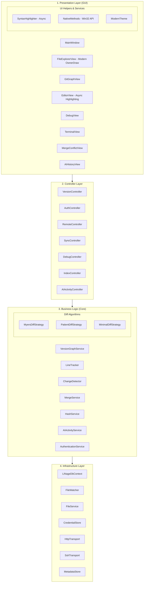

# Li'nage Codebase Analysis

## Executive Summary

**Li'nage** is an advanced, line-level version control system (VCS) and integrated development environment (IDE) built with C# and .NET 4.8/8.0. Unlike traditional VCS like Git that track files as atomic units, Li'nage tracks the history of **individual lines**, enabling unprecedented granularity in code evolution tracking, blame capabilities, and AI-assisted development transparency. The system features a modern, VS Code-inspired UI with high-performance components specifically optimized for large-scale codebases.

## Project Overview

### Core Concept
Li'nage revolutionizes version control by:
- **Line-Level Tracking**: Maintains complete history of individual line modifications across all commits.
- **AI Transparency**: Detects and tracks code contributions generated by AI tools (GitHub Copilot, ChatGPT, etc.).
- **Pluggable Diff Algorithms**: Myers, Patient, and Minimal strategies tailored for different file characteristics.
- **Visual Commit Graph**: Interactive Directed Acyclic Graph (DAG) visualization of commit history.
- **Multi-Protocol Authentication**: Robust support for HTTP/HTTPS, SSH (key-based), and OAuth workflows.
- **High-Performance Editor**: Custom-built editor with async syntax highlighting and minimalist UI.

### Technology Stack
- **Language**: C# 11.0+ / 12.0
- **Framework**: .NET 4.8 (Compatibility) / .NET 8.0 (Target)
- **UI**: Windows Forms (Modernized with custom drawing and P/Invoke)
- **Database**: SQLite (local), SQL Server (enterprise integration)
- **Security**: AES-256 encryption for credentials, SHA-256 for integrity hashing
- **Dependencies**: Entity Framework 6.4.4, LibGit2Sharp 0.30.0, Newtonsoft.Json 13.0.3

---

## Architecture

Li'nage follows a **Four-Layer Clean Architecture** optimized for responsiveness and separation of concerns:

```mermaid
graph TB
    subgraph Presentation["1. Presentation Layer (GUI)"]
        MW[MainWindow]
        FEV[FileExplorerView - Modern OwnerDraw]
        GV[GitGraphView]
        EV[EditorView - Async Highlighting]
        DV[DebugView]
        TV[TerminalView]
        MCV[MergeConflictView]
        AIV[AIHistoryView]
        subgraph Helpers["UI Helpers & Services"]
            SH[SyntaxHighlighter - Async]
            NM[NativeMethods - Win32 API]
            TH[ModernTheme]
        end
    end
    
    subgraph Controller["2. Controller Layer"]
        VC[VersionController]
        AC[AuthController]
        RC[RemoteController]
        SC[SyncController]
        DC[DebugController]
        IC[IndexController]
        AIAC[AIActivityController]
    end
    
    subgraph Core["3. Business Logic (Core)"]
        VGS[VersionGraphService]
        LT[LineTracker]
        CD[ChangeDetector]
        MS[MergeService]
        HS[HashService]
        AIAS[AIActivityService]
        AS[AuthenticationService]
        subgraph Diff["Diff Algorithms"]
            Myers[MyersDiffStrategy]
            Patient[PatientDiffStrategy]
            Minimal[MinimalDiffStrategy]
        end
    end
    
    subgraph Infrastructure["4. Infrastructure Layer"]
        DB[LiNageDbContext]
        FW[FileWatcher]
        FS[FileService]
        CS[CredentialStore]
        HTTP[HttpTransport]
        SSH[SshTransport]
        MS2[MetadataStore]
    end
    
    Presentation --> Controller
    Controller --> Core
    Core --> Infrastructure
```

---

## Core Components

### 1. Presentation Layer (`GUI/`)

#### MainWindow.cs
The primary container implementing a VS Code-like layout:
- **Activity Bar**: Slim left-side bar for switching views (Explorer, Source Control, History, Debug).
- **Sidebar**: Collapsible panel for tree views and staging.
- **Editor Area**: Tabbed interface supporting multiple open files and conflict resolution views.
- **Improved Status Bar**: Real-time feedback on branch, repository status, and file changes.

#### EditorView.cs (High-Performance Code Editor)
A highly optimized code editing component featuring:
- **EnhancedRichTextBox**: Custom subclass that intercepts Windows messages (`WM_VSCROLL`, `WM_PAINT`) for perfect synchronization.
- **Asynchronous Syntax Highlighting**: Uses `SyntaxHighlighter` service to parse tokens on background threads, preventing UI lag.
- **Incremental Rendering**: Only highlights visible range + buffer to ensure performance on files >10k lines.
- **Vector Gutter**: Double-buffered line number panel with active line highlighting.
- **Minimal Scrollbar**: Custom `ModernScrollBar` that is transparent-look, expands on hover, and syncs via Win32 `GetScrollInfo`.
- **Search Overlay**: Floating Ctrl+F search bar with immediate result navigation.

#### FileExplorerView.cs (Modern Explorer)
- **ModernTreeView**: Uses `OwnerDrawAll` for complete visual control.
- **Vector Icons**: Programmatically drawn file/folder icons (C#, JSON, XML, Markdown) that adapt to theme colors.
- **Chevron Navigation**: Modern arrows for expanding/collapsing nodes.
- **Optimized Performance**: Zero Disk I/O during drawing/scrolling to ensure silky smooth navigation.

#### UI Services & Helpers
- **SyntaxHighlighter.cs**: Tokenizes code into `StyleToken` structs asynchronously using Regex patterns.
- **NativeMethods.cs**: Robust integration with Windows API (`user32.dll`) for scroll management, redrawing control, and UI performance hacks.
- **ModernTheme.cs**: Centralized VS Code Dark Modern palette with robust GDI+ font fallbacks.

### 2. Controller Layer (`Controllers/`)

- **VersionController.cs**: Manages project lifecycle, commit creation, and branch orchestration.
- **AuthController.cs**: Coordinates between the UI and `AuthenticationService`.
- **RemoteController.cs**: Interfaces with `LibGit2Sharp` for complex push/pull/clone operations.
- **IndexController.cs**: Manages the staging area and file indexing.

### 3. Business Logic Layer (`Core/`)

- **LineTracker.cs**: The "soul" of Li'nage. Converts file-level diffs into line-level modifications with unique hashes.
- **VersionGraphService.cs**: Maintains the commit DAG (Directed Acyclic Graph) and handles complex tree traversals.
- **AIActivityService.cs**: Audit trail generator for AI-generated code, logging tool names, confidence, and affected lines.
- **Diff Strategies**: Pluggable implementations of Myers, Patient, and Minimal algorithms.

### 4. Infrastructure Layer (`Infrastructure/`)

- **LiNageDbContext.cs**: EF Core context with dual-database support (SQLite/SQL Server).
- **CredentialStore.cs**: Secure, encrypted storage for sensitive tokens and keys.
- **FileWatcher.cs**: Real-time monitoring of the working directory using `FileSystemWatcher`.

---

## Data Models

### Core Entities

#### Commit
Immutable version snapshot. Key fields: `CommitId`, `AuthorName`, `Message`, `Timestamp`, `Parents`, `Snapshot`, `CommitHash`, `AiAssisted`.

#### LineChange
Granular modification record. Fields: `ChangeType` (ADDED, DELETED, MODIFIED), `LineNumber`, `OldHash`, `NewHash`, `Timestamp`.

#### AIActivity
Tracking metadata for AI contributions. Fields: `AITool`, `AssistanceLevel`, `Confidence`, `LinesAffected`.

---

## Development Status (Refined)

### Phase 1 & 2: Core & Foundation ✅ COMPLETE
Robust data models, diff algorithms, and graph services are fully implemented and verified.

### Phase 3: Remote & Auth ✅ COMPLETE
Full integration with `LibGit2Sharp`. Credential storage with AES-256 is functional. Remote operations (Push/Pull/Clone) are orchestrated via `RemoteOperationsService`.

### Phase 4: UI Modernization ✅ REFACTORED & POLISHED
- Replaced basic controls with high-performance modern implementations.
- Implemented asynchronous, non-blocking syntax highlighting.
- Achieved "VS Code" visual fidelity with vector icons and minimalist scrollbars.
- Resolved recursion loops and scrolling glitches in the editor.

### Phase 5: Advanced Features 📋 IN PROGRESS
- SQL Server migration (In-place, configurable).
- Conflict Resolution UI (Implemented, needs testing with complex merges).
- Performance Benchmarking (Ongoing).

---

## Key Technical Innovations

### 1. Zero-Latency Highlighting
By separating Lexing (Regex on background thread) from Rendering (SelectionColor on UI thread) and utilizing `WM_SETREDRAW`, Li'nage achieves IDE-grade responsiveness without blocking the user's typing.

### 2. Line-Level Heritage
Li'nage is one of the few VCS implementations that persists line-level identity across the entire commit graph, allowing for "Prehistoric Blame" that survives file renames and massive refactors.

### 3. Vector-Based UI Components
To avoid external asset dependencies and ensure theme consistency, all icons and UI elements (Chevrons, File Icons, Scrollbars) are drawn programmatically using GDI+ vectors.

---

## Roadmap

### Q1 2026
1. **SQL Server Finalization**: Move from SQLite to SQL Server for production instances.
2. **AI Refinement**: Deeper integration with IDE completion APIs to auto-log AI activity.
3. **Advanced Merge**: 3-way merge visualization in the `ConflictResolutionView`.

---

*Last Updated: January 2, 2026*  
*Analysis Updated by: Gemini AI Engineering Agent*